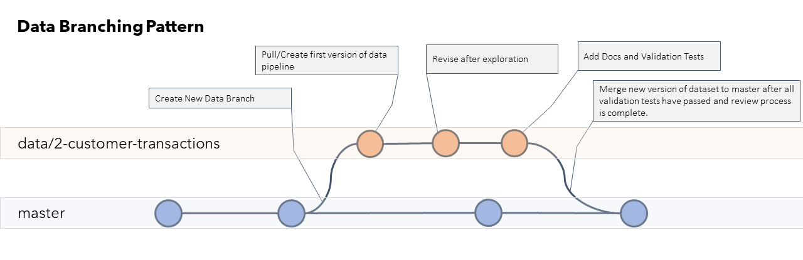
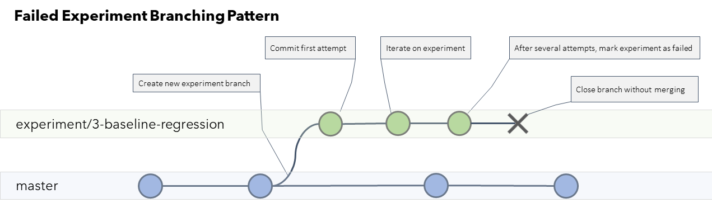
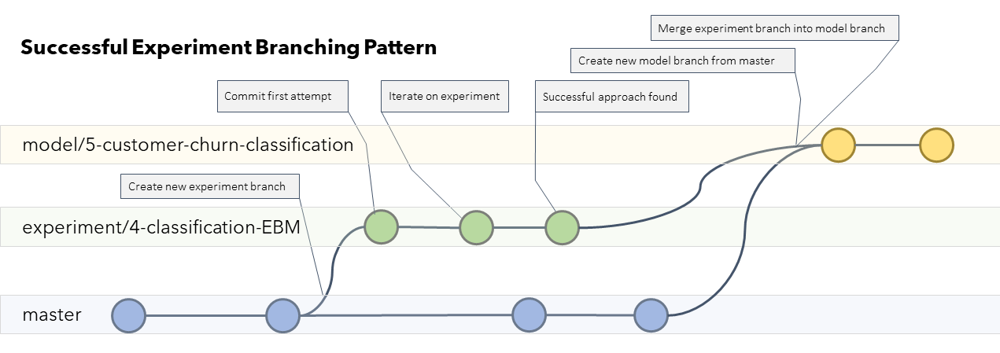
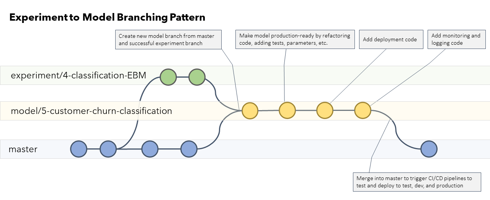

# Типы веток

В рамках процесса Data Science Lifecycle Process предложена новая стратегия ветвления, отражающая путь типичного проекта в Data Science. На практике есть важные различия между Data Science и разработкой ПО. Главное - работа с данными требует большого количества экспериментов и прототипирования и не имеет четкого линейного пути продвижения. Типичные стратегии ветвления с трудом адаптируются к тому факту, что:

1. Значительная часть кода, который вы пишете, является одноразовым; его ценность заключается в полученных знаниях, а не в самой функциональности.
2. Зачастую заранее непонятно как выглядит конечный результат.
3. Хотя мы и не хотим вливать весь наш код в основную ветку, но мы также и не хотим его выбрасывать.

Вместо того, чтобы изобретать велосипед, мы адаптировали существующие стратегии ветвления к потребностям жизненного цикла Data Science. Для большей части кода, который мы пишем, мы сможем использовать стандартные стратегии ветвления Feature/Issue. Для остального мы создали несколько новых типов веток и рабочих процессов для их использования.

См. также: [Примеры диаграм ветвления](./media/branching-patterns.pdf)

## Типы веток
- [Типы веток](#типы-веток)
  - [Типы веток](#типы-веток-1)
  - [Основные рабочие ветки](#основные-рабочие-ветки)
    - [Main](#main)
    - [Development (Optional) - в нашем проекте не используем (пока)](#development-optional---в-нашем-проекте-не-используем-пока)
  - [Feature and Issue Branches](#feature-and-issue-branches)
    - [Соглашение о наименовании (Naming Convention)](#соглашение-о-наименовании-naming-convention)
      - [Примеры](#примеры)
  - [Data Branches](#data-branches)
    - [Соглашение о наименовании](#соглашение-о-наименовании)
      - [Примеры](#примеры-1)
    - [Приемник для PR](#приемник-для-pr)
    - [Диаграмма](#диаграмма)
    - [Лучшие практики](#лучшие-практики)
  - [Explore Branches](#explore-branches)
    - [Соглашение о наименовании](#соглашение-о-наименовании-1)
      - [Примеры](#примеры-2)
    - [Приемник для PR](#приемник-для-pr-1)
    - [Лучшие практики](#лучшие-практики-1)
  - [Experiment Branches](#experiment-branches)
    - [Соглашение о наименовании](#соглашение-о-наименовании-2)
      - [Примеры](#примеры-3)
    - [Приемник для PR](#приемник-для-pr-2)
      - [Неудачные эксперименты](#неудачные-эксперименты)
        - [Диаграмма](#диаграмма-1)
      - [Успешный эксперимент](#успешный-эксперимент)
        - [Диаграмма](#диаграмма-2)
    - [Лучшие практики](#лучшие-практики-2)
      - [Создавайте новые Feature Branches для полезных компонентов](#создавайте-новые-feature-branches-для-полезных-компонентов)
  - [Model Branches](#model-branches)
    - [Соглашение о наименовании](#соглашение-о-наименовании-3)
      - [Примеры](#примеры-4)
    - [Приемник для PR](#приемник-для-pr-3)
    - [Даграмма](#даграмма)
    - [Лучшие практики](#лучшие-практики-3)
  

## Основные рабочие ветки

Your collaboration branch(es) is (are) the primary branch(es) for your repository. They will be the target for your Pull Requests and the code in them will be what you ultimately ship.

### Main

Ветка `main` - основная рабочая ветка. Это источник правды вашего репозитория. Все, что в ветке `main` должно быть рабочим в каждый момент времени.

### Development (Optional) - в нашем проекте не используем (пока)

Many teams opt to have another collaboration branch called development. Whether you use this is up to your team. If you opt for a development branch, then development should be the target of your pull requests for all features instead of Main.

You will then merge development to Main per your team's workflow.

## Feature and Issue Branches

Все что не покрыто явно специальными типами веток, должно следовать стандартным лучшим практикам (напр., GitHub Flow).

Создайте ветку для каждой задачи или доработки, которую вы хотите добавить, и по завершении работы влейт ее в `main` при помощи Pull Request.

### Соглашение о наименовании (Naming Convention)

>[issue-number]-descriptive-branch-name

#### Примеры
> [issue-number]-calculate-cltv  
> [issue-number]-custom-risk-scoring-function  
> [issue-number]-docs/data-gotchas-and-caveats

## Data Branches

Используйте этот тип веток для разработки пайплайнов приема данных для имеющихся датасетов или для создания новых датасетов. Создание документации, касающейся этих датасетов или пайплайнов, тоже должно быть в этой ветке. Когда пайплайн закончен, вы можете влить эту ветку в основную. 

### Соглашение о наименовании

> data/[issue-number]-dataset-name  

#### Примеры
> data/[issue-number]-customer-purchase-history  
> data/[issue-number]-product-prediction-data  
> data/[issue-number]-customer-reviews-text-corpus

### Приемник для PR

Целью (приемником) для Pull Request из data-веток должна быть основная ветка.

### Диаграмма

### Лучшие практики

- После слияния кода пайплайна в `main`, используйте оркестратор для запуска пайплайна на ваших данных.
  - Регистрируйте новую версию вашего датасета после каждого слияния с `main`.
  - Входные и выходные каталоги задавайте через параметры, чтобы легко изменять их в зависимости от того, где вы развертываете (тестовая, dev, prod среда и т. д.).
- Включайте файлы описания схем, словари данных и другую документацию по данным в Pull Request при слиянии data-веток. Данные менее полезны без документации.
- Пишите тесты для валидации данных, проверки схемы и проверки согласованности вместо того, чтобы вручную просматривать датасеты. Это гарантирует, что при обновлении или изменении данных вы можете быть более уверены в том, что все по-прежнему работает корректно.

## Explore Branches

Используйте этот тип веток для совместной работы и исследования по мере работы.

### Соглашение о наименовании

> explore/[issue-number]-description-of-exploration

#### Примеры

> explore/[issue-number]-customer-sales-data  
> explore/[issue-number]-customers-multiple-accounts  
> explore/[issue-number]-call-transcripts

### Приемник для PR

НЕТ. Эти ветки не вливаются в `main`. Если вы создали что-то полезное, создайте новую ветку для этого (см. Лучшие практики).

### Лучшие практики

- НЕ сливайте explorе-ветки в `main` чтобы не замусорить репозиторий. Для сохранения истории работы достаточно создать PR для такой ветки, но не сливать ее в `main`.

> Очень важно помечать PR'ы и связывать их с релевантными задачами, чтобы потом найти их позже после закрытия.

- Если вы создали что-то полезное, создайте другую ветку, где вы превратите свой код исследования в документацию, виджеты, код фрагменты и т. д.

> Не стоит коммитить код, который временный в природе. Если он имеет постоянное значение, уделите время, чтобы превратить его в нормальный код.

- В начале исследования всегда ставьте цель. Увлечься очень легко. Если четкая цель не приходит в голову, ограничьте время исследования и опишите статус в конце. 

## Experiment Branches

Используйте этот тип веток для работы (в т.ч. совместной) над экспериментами. Поскольку вы часто будете создавать модели и признаки, которые не сработают, не стоит коммитить все это в вашу основную ветку.

### Соглашение о наименовании

> experiment/[issue-number]-experiment-description  

#### Примеры

> experiment/[issue-number]-sales-forecasts-baseline  
> experiment/[issue-number]-sales-forecasts-automl  
> experiment/[issue-number]-sales-forecasts-custom-loss

### Приемник для PR

Нет.

#### Неудачные эксперименты

Если эксперимент не удался, пометьте Experiment issue как неудачный с помощью метки, обновите эксперимент с TLDR, описывающим, что вы попытались и как это закончилось, и закройте PR без слияния. Прикрепите ссылку на инструмент для отслеживания экспериментов (если есть), чтобы остальные могли изучить запуски.

##### Диаграмма

)

#### Успешный эксперимент

Если эксперимент удался и вы хотите начать процесс развертывания:

1. Обновите задачу эксперимента (TLDR), отметьте ее как успешную с помощью метки.
2. Создайте задачу типа Model (Модель) для подготовки модели и конвейеров к развертыванию.
3. Создайте model-ветку, используя ветку `main` в качестве основы.
4. Влейте (merge) текущие изменения из ветки `main` в вашу experiment-ветку и разрешите все конфликты.
5. Измените цель (target) Pull Request-а эксперимента на созданную model-ветку.
6. Влейте Pull Request в model-ветку и закройте задачу эксперимента.
7. Удалите experiment-ветку после слияния Pull Request.

##### Диаграмма

### Лучшие практики

- Не забывайте коммитить код перед запуском задания, чтобы вы могли записать чистый (полный) коммит в историю эксперимента!
- Постарайтесь отслеживать эксперименты в инструменте логирования ML, чтобы потом видеть что вы уже пробовали.

####  Создавайте новые Feature Branches для полезных компонентов

По мере того, как вы экспериментируете, вы часто будете создавать полезные компоненты, которые можно использовать в других местах. В этом случае вам следует создать новую ветку feature-branch для последующего вливания полезного кода в основную ветку, чтобы другие могли его использовать. Вот несколько примеров:

- Создание полезного признака (фичи) для ваших моделей
- Создание пользовательской метрики оценки
- Создание функции-утилиты, которая помогает вам выполнять задачу.

## Model Branches

Use this branch to turn your successful experiments into deployable models. This is similar to an integration branch. In this branch you'll make sure your model runs from end to end.
Используйте этот тип веток для превращения успешных экспериментов в модели, которые можно развернуть. Это похоже на интеграционные ветки (в других процессах). В этой ветке вы сделаете так, чтобы ваша модель запускалась от начала до конца.

Используйте эту ветку для:

- Рефакторинг и параметризация кода модели
- Обучение модели на всем датасете и запись результатов
- Регистрация и развертывание модели
- Запуск тестов по моделям
- Создание конвейеров развертывания и переобучения
- Добавление дополнительного логирования и мониторинга
- Выполнение окончательного обзора и одобрения перед развертыванием.

### Соглашение о наименовании

> model/[issue-number]-descriptive-model-name

#### Примеры

> model/[issue-number]-forecast-customer-sales-baseline  
> model/[issue-number]-forecast-customer-sales-ensemble
> model/[issue-number]-classify-customer-transcripts

### Приемник для PR

Когда ваша модель готова, нужно влить model-ветку в `main`. Оттуда уже можно, используя процесс CD (Continous Deployment), развернуть модель.

### Даграмма

### Лучшие практики

Ветки моделей - это место, где ваш код закаляется и готовится для продакшена.

- Для автоматизации частей этого процесса, используйте MLOps.
- Создайте post-deployment strategy, включая метрики для мониторинга и расписание переобучения
- Чтобы все шло хорошо, команды data science и devops должны работать сообща
- Приготовьте план отката модели на случай, если ее производительность не соответствует ожиданиям.

